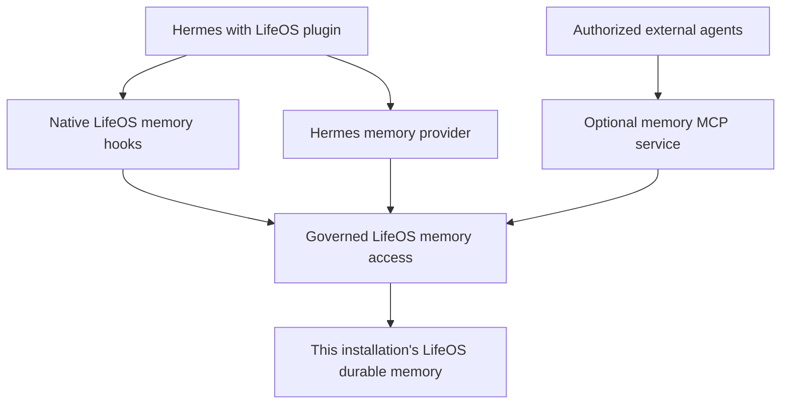

# Future memory integration: LifeOS as the durable store

Date: 2026-09-30. Status: Adrian accepted this design direction for later implementation. This feature is not implemented. Start after the [hook parity completion gate](../docs/parity-resolution-plan.md) passes. This record does not authorize a memory migration or a change to a running installation.

## Installation model

Build a self-contained installation: Hermes, the plugin, and LifeOS on a new server. The user installs Hermes, installs the plugin, and installs LifeOS through the plugin settings page. Memory must work on that server without another machine.

Use `.212` for development and disposable test profiles. The working `.211` and `.213` systems are references only. Leave both unchanged. Do not copy their memory, hard-coded addresses, caller policies, SSH configuration, or deployment layout into the new installation.

Sharing memory with other agents is optional. It exposes this installation's LifeOS store; it does not connect the installation to the existing `.211` archive.

## Accepted ownership

LifeOS owns durable memory for a LifeOS-enabled Hermes installation. Keep Hermes's memory manager and integrate through its supported memory-provider interface. Replacing the runtime memory manager would add code changes and update risk without resolving a storage requirement.

| Responsibility | Owner |
| --- | --- |
| Durable facts, project findings, decisions, and lessons | LifeOS knowledge archive |
| Principal preferences and assistant working preferences | LifeOS principal and assistant memory |
| Automatic recall and durable memory review | LifeOS hooks and tools |
| Conversation history and session search | Hermes |
| Context compression and active session management | Hermes |
| Procedural skills and skill learning | Existing Hermes and LifeOS mechanisms; assess separately from durable memory |
| Shared access from authorized agents | Plugin-provided Model Context Protocol (MCP) service |

One authoritative store can contain several LifeOS memory layers. It does not require one file for every kind of memory. Conversation history remains separate from curated durable facts.

The target default disables independent writes and context injection from Hermes's built-in `MEMORY.md` and `USER.md` stores. Preserve existing files. Enable that default only after the supported Hermes version passes the behavior tests below.

Do not maintain two editable copies of a fact. A derived cache, if needed, must identify its LifeOS source and refresh rule. It cannot become another authoritative store.

## Why this direction

Two independent stores can retain conflicting preferences or stale corrections. Synchronizing them would require conflict resolution, correction propagation, deletion propagation, and ownership rules. Give LifeOS ownership instead.

Keeping both stores active offers a less disruptive transition and retains existing Hermes memory controls. It also retains the duplication risk. Provide a choice to keep the current setup, explain its limits, and test the LifeOS default before switching.

One durable store makes memory availability more important. The plugin must show failures and provide recovery. It must not silently write to the former Hermes store when LifeOS is unavailable.

## Two interfaces, one write policy

Provide a Hermes memory provider and an MCP service backed by the same governed LifeOS access implementation. Each interface must use the installed LifeOS paths and compatibility set.

The provider supplies explicit memory tools and integrates with Hermes. The MCP service gives Claude Code, Codex, OpenCode, or another client access without requiring that client to run Hermes or the full LifeOS hook set.

Assess reuse of the existing `lifeos-memory-mcp` project as a versioned dependency or shared component. Keep one maintained implementation of its policy and protocol. Packaging remains open; do not assume that its current deployment can be copied unchanged.

Use local process access for the colocated installation. Start remote sharing disabled. For the first remote transport, assess SSH carrying MCP over standard input and output, with a restricted key for each client. A separate HTTP service is not a prerequisite. Credentials must bind the client policy; a caller-name argument alone is not an access boundary.

## Preserve hooks and prevent duplicate work

Keep the native LifeOS memory hooks and their observable behavior. When `MemoryTurnStart` owns automatic recall, the provider must not inject a second copy of the same records. Explicit searches remain available.

Map all loaded context, including small memory files and any LifeOS content rendered into `SOUL.md`. Identify snapshots that can become stale, their refresh rules, and repeated injection across hooks and the provider. Avoid introducing an extra recall path to compensate for a broken hook.

LifeOS owns durable memory review. Assess how to retain Hermes skill learning independently. If Hermes produces a durable memory candidate, route it through the same governed LifeOS write or proposal path. Do not disable all Hermes background review solely to stop duplicate fact extraction.

## Memory operations and failures

Define and test remembering, recalling, correcting, and forgetting. The existing MCP search, retrieval, and append-style writes do not establish equivalence with Hermes add, replace, and remove operations. Use supported LifeOS operations or an explicit review workflow for changes that need approval.

A correction must prevent ordinary recall from presenting a superseded claim as current. An appended correction alone is insufficient if search still returns the original claim. Define what forgetting removes, what audit evidence remains, and whether that evidence can enter model context.

Record the writer and source for saved facts. Verify concurrent writes, interrupted writes, repeated requests, record identity, and recovery against LifeOS's actual storage behavior. Do not assume either interface supplies these guarantees.

Report unavailable recall and failed saves clearly. Never report a failed save as successful. Preserve the conversation when memory fails unless an existing required LifeOS hook specifies a blocking outcome. Test that hook outcome rather than weakening it.

## Privacy and sharing

Set read and write permissions for each authenticated client. Permissions must follow the client's approved use and model route. A process running on the LAN may still send returned records to a cloud model.

Keep memory access permissions separate from delivery permissions. A record permitted in a private session is not automatically permitted in a public Discord channel. Verify private chats, server channels, threads, scheduled messages, and child-agent context where supported.

Protect credentials and sensitive records through the governed access path. Document what the service enforces and what requires operating-system isolation or agent instructions. Do not describe a configurable caller name as enforced isolation.

## Preferences page

| Proposed control | User-visible purpose |
| --- | --- |
| Use LifeOS for lasting memory, recommended | Hermes and connected agents remember facts and preferences in LifeOS. Hermes keeps conversation history separately. |
| Keep the current memory setup | Preserve separate stores and explain that facts saved in one may not appear in the other. |
| Memory health | Show whether recall and saving work, and explain failures. |
| Share memory with other agents | Enable optional MCP connection setup. Remote sharing starts disabled. |
| Client permissions | Show and configure each client's permitted read and write categories. |
| Automatic memory review | Configure the LifeOS review cadence and model through the existing model-routing choices. |
| Review existing Hermes memory | Preview an optional import and resolve conflicts before changing ownership. |
| Restore previous configuration | Restore memory settings without deleting LifeOS records. |

These controls are a design proposal, not available page actions. Keep normal setup understandable without knowledge of Cortex, provider internals, or SSH commands.

## Implementation order and acceptance evidence

1. After the hook gate passes, map the actual `.212` reads, writes, reviewers, and context injection. Use synthetic data to measure duplication and stale recall.
2. Define the shared access contract and implement the provider against disposable LifeOS roots. Preserve hook behavior and establish one automatic recall owner.
3. Verify remembering, correcting, forgetting, review behavior, skill learning, and failure reporting before disabling built-in durable writes in a test profile.
4. Add optional MCP access and authenticate client policies. Prove that Hermes and another agent can exchange an allowed fact through the same store.
5. Test restarts, concurrent clients, child tasks, scheduled runs, and public-channel delivery restrictions. Test rejected writes and interrupted operations.
6. Add the preferences controls and a clean installation test. Verify that the installation works independently of `.211` and `.213`.
7. Test plugin and LifeOS update transactions, backup and restore, and configuration rollback while preserving synthetic memory. Treat importing existing Hermes memory as a separate, optional feature.

Save commands, revisions, raw results, and expected outcomes for each acceptance case. Enable the recommended default only when the supported compatibility set passes these checks. Memory integration does not close or relax a hook parity gap.

## Questions to resolve during implementation

- Can the supported Hermes version disable both built-in stores while retaining provider tools and independent skill learning?
- Which LifeOS operations correctly implement corrections and forgetting? What approval and retention rules apply?
- How do native memory hooks, the provider, and rendered context avoid duplicate or stale records across an existing session?
- Which locking, retry, and write-identity guarantees does LifeOS already provide?
- How should optional MCP support be packaged and versioned with plugin and LifeOS updates?
- Which client classes and delivery restrictions should a fresh installation offer by default?
- Which failure cases can preserve conversation progress, and which must block under existing LifeOS hook rules?

## Evidence and limits

The 2026-09-30 inspection found built-in memory and profile enabled on `.212`. Its installed `lifeos` plugin is a tool guard. `MemoryTurnStart.hook.ts` contains hot-memory injection and task retrieval; `MemoryReviewFire.hook.ts` owns reviewer cadence. These code observations do not prove duplicate writes or successful reviewer operation.

The existing `.211` memory MCP returned `integrity_error` during the discussion. The cause was not established. Use it as a failure-handling example, not a diagnosis of `.212` or a dependency of this design.

Hermes documents its [memory-provider interface](https://hermes-agent.nousresearch.com/docs/developer-guide/memory-provider-plugin) and [built-in memory controls](https://hermes-agent.nousresearch.com/docs/user-guide/features/memory#configuration). Verify both against the plugin's pinned host version. Documentation for current upstream does not prove support in the pinned fixture.
